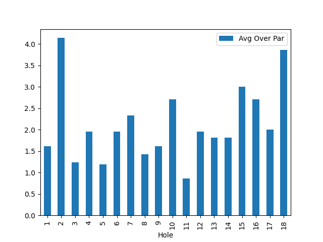
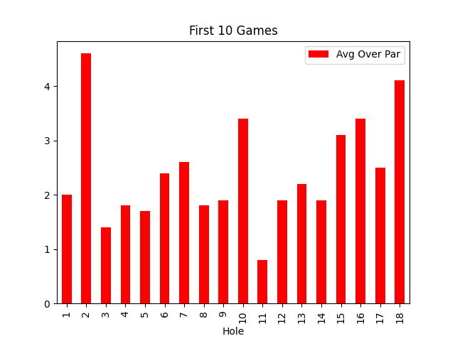
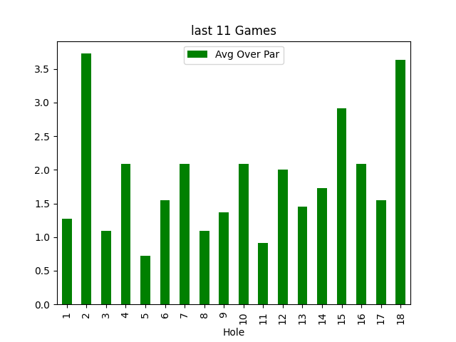
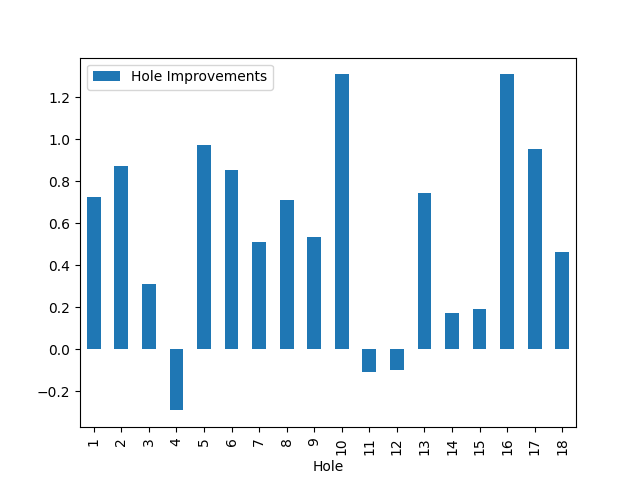
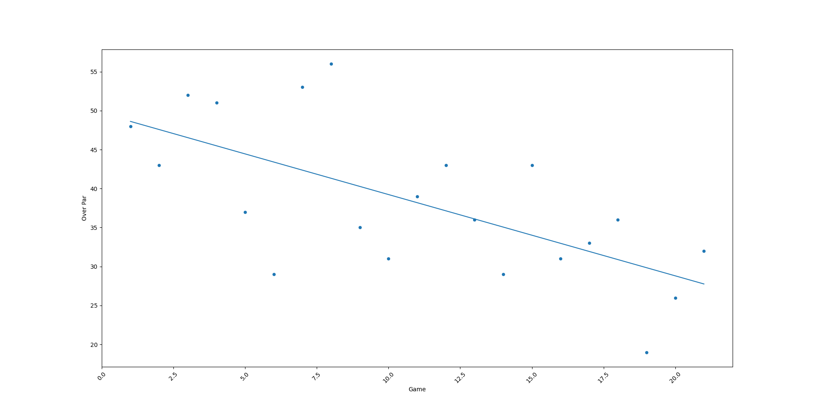
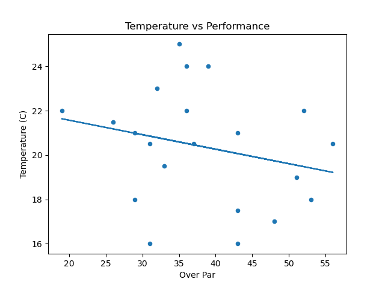
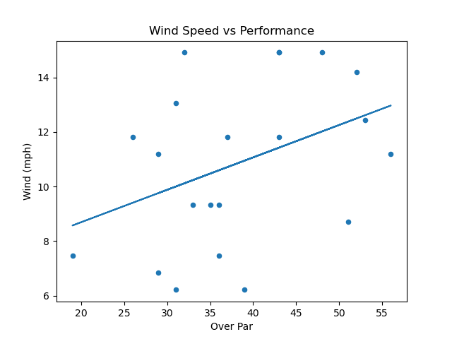

# Golf Performance Analysis
## Overview
This project analyses personal golf performance data over a series of 21 games. Using Python and data visualisation tools, the project explores trends in scores, improvement over time, and the impact of environmental factors such as temperature and wind speed.

## Data 
- Date of each round.
- Hole by hole performance.
- Enviromental factors such as temperature and wind speed.

## Analysis & Visualisations
The project includes 7 key visualisations:
1. **Average "Over Par" on Each Hole**

*Shows which holes had higher or lower scores on average.*

2. **First 10 Games Performance** – early trends in scores.

*Highlights early trends in overall performance.*

3. **Last 11 Games Performance** – shows recent performance trends.
  
*Shows recent performance trends.*

5. **Hole Improvements** – progress over multiple games per hole.
  
*Tracks performance improvement on each hole over time.*
  
7. **Over Par vs Game Number** – linear regression and trend analysis over time.
  
*Linear regression and trend analysis over all games.*
 
9. **Temperature vs. Performance** – explores impact of temperature on scores.
  
*Explores potential environmental effects of temperature.*
 
11. **Wind Speed vs. Performance** – examines impact of wind on scores.
  
*Examines the impact of wind on scores.*

## Key Insights
- Performance generally improved over time - hypothesis testing was used to confirm this at the 5% significance level.  
- Environmental factors such as temperature and wind showed no statistically significant effect in this dataset (p > 0.05).  
- Certain holes showed consistent improvement, highlighting patterns in performance.

## Tools & Technologies
- **Python** (pandas, numpy, matplotlib, statsmodels, seaborn)  
- **Visual Studio Code** for analysis  
- **Git & GitHub** for version control and project sharing

## How to Use
1. Clone the repository:  
   ```bash
   git clone https://github.com/Edenalexander/Golf-Personal-Project.git
